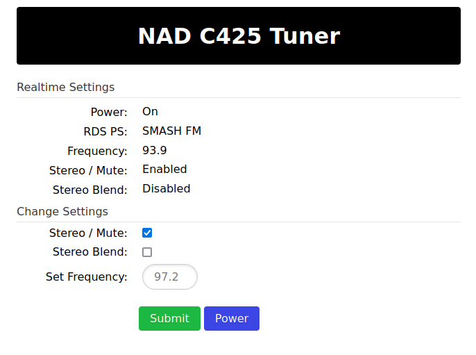

# WebTuner

[](https://github.com/bkram/PyNadTuner/actions/workflows/buildx.yml)

## Screenshot



A Web application to control the NAD Tuners models C 425 or C 426 via the tuner's serial port.

## Supported tuners

Successfully tested on a "grey/black" C 425 and a "silver/titanium" C 426.

## WebTuner usage

Connect your tuner to your device with a serial to usb cable, if the connection to the tuner is not on /dev/ttyUSB0, or if you have more tuners the environment variable TUNER_PORT can be set to the correct one before starting the webtuner

### Local installation run

#### Requirements

See the included requirements.txt

#### Startup

Make sure the user you are running the WebTuner under has permissions to open the serial port, on Ubuntu you can add the user to the 'dialout' group.

```bash
python WebTuner.py
```

Or

```bash
./launch.sh
```

### Docker based run

The images in ghcr.io are for linux/amd64, linux/arm64 and linux/arm/v7

#### To run on the console use

```sh
sudo docker run --rm --name=WebTuner -p 8181:8181 --device /dev/ttyUSB0:/dev/ttyUSB0 ghcr.io/bkram/pynadtuner:latest
```

#### To run in the background

```sh
sudo docker run -d --name=WebTuner -p 8181:8181 --device /dev/ttyUSB0:/dev/ttyUSB0 --restart unless-stopped ghcr.io/bkram/pynadtuner:latest
```

Point your webbrowser to <http://docker-host:8181> and enjoy.

## FAQ

### Why does it not show the station's strength ?

The tuner does not expose this information

### Sometimes the Standby button does not work ?

This has been experienced with the C 425, manually powering it off and on seems te resolve the issue

### RDS RT does not always work

The tuner does not seem to pass *all* the information *all the time* from the RDS decoder over the serial bus even though the tuner's display seems to show the correct text.

Standby toggling or changing the frequency will make the tuner send the RDS data once more.

## NadSerial

This python package implements the serial handling required to communicate with NAD devices, this could be extended to include more NAD devices such as recievers and amplifiers which share the same protocol.
However, more recent devices have switched to another serial protocol, which is not compatible with this package.
