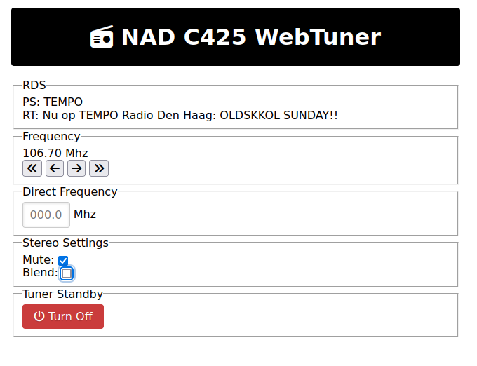

# WebTuner

## Screenshot



A Web application to control the NAD Tuners models C 425 or C 426 via the tuner's serial port.

## Supported tuners

Successfully tested on a "grey" C 425 and a "silver" C 426.

## Requirements

See the included requirements.txt

## WebTuner usage

Connect your tuner to your device, it expects to a connection on /dev/ttyUSB0, this can be overriden by specifying the
correct port='/dev/ttyUSBX' when calling Device().

```bash
python WebTuner.py
```

Point your webbrowser to <http://0.0.0.0:8181> and enjoy.

## FAQ

### Why does it not show the station's strength ?

The tuner does not expose this.

### Why does it not show the station's RDS text ?

It seems that this maybe is kind of broken, the information is send over the serial bus, but parsing it according to the specifications only works upto a certain  ength.

Maybe this can be fixed on the python side.

## NadSerial

This python package implements the serial handling required to communicate with NAD devices, this could be extended to include more NAD devices such as recievers and amplifiers which share the same protocol.
However the more recent devices have switched to another serial protocol, which is not compatible with this package.
